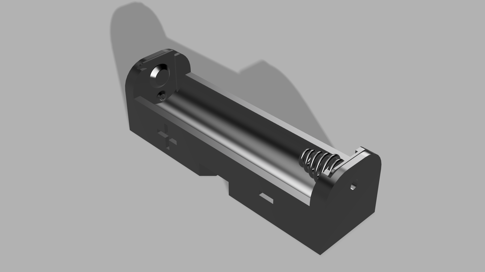
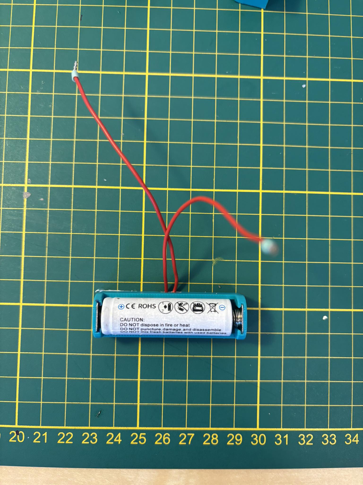
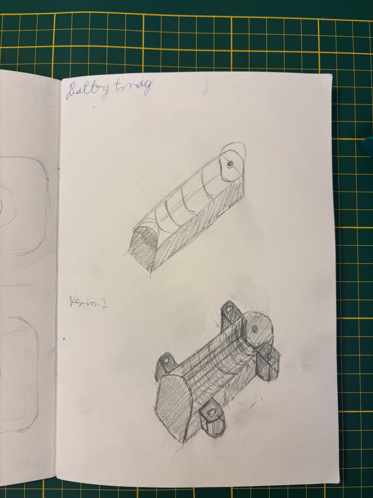
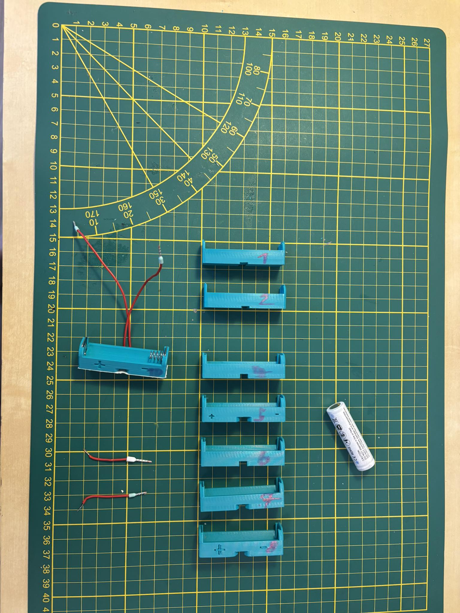
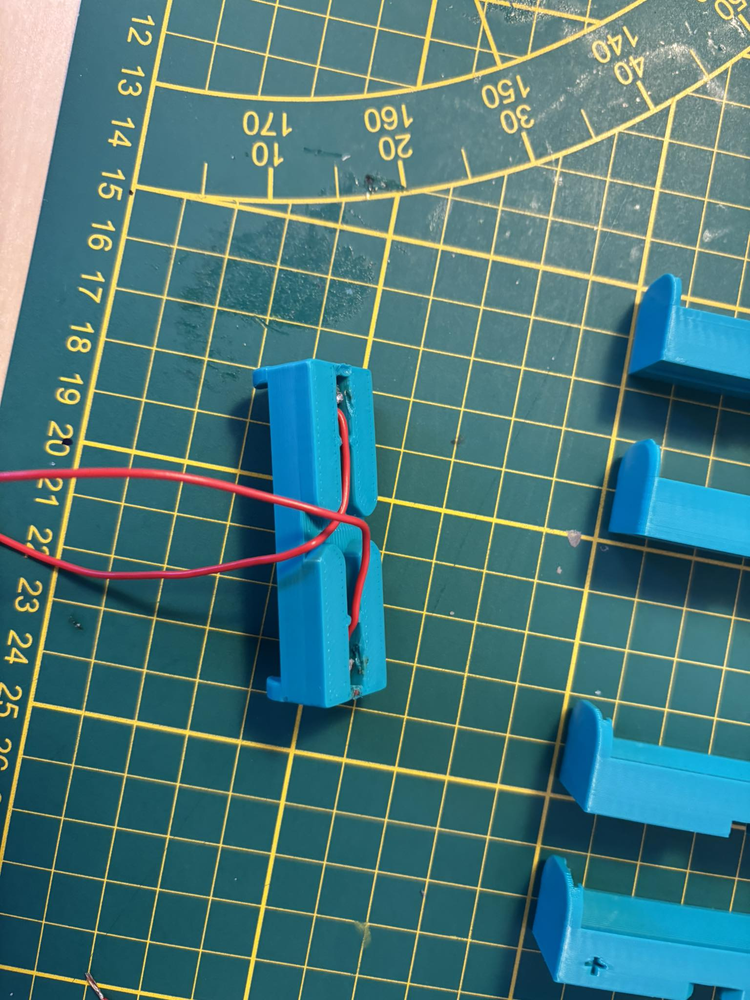

# Custom Battery holder for 14500/AA battery type
Important note ⚠️❗: this repository is a part of Crius Space can-sat Team report.

  <figure>
    
    <figcaption style="text-align: center;">Logo of my team "Crius SPACE"</figcaption>
  </figure>
  <figure>
    
    <figcaption style="text-align: center;">We are taking part in can-sat competition by ESA</figcaption>
  </figure>

  
  
<em>Figure 1: Render of the tray model.</em>

## Content and purpose of this repository:
- this repository contains simple model (in .stl and .3fd extension) that is ready to print and shows our capabilities in terms of 3D design and integration with pre made parts like batteries.

- this model is made for 14500/AA battery type, allowing user to have 1.5V or 4.2V power supply, in the future we will use this model to develop fully function battery holder for our can-sat.

## what is in particular folders
- documentation - documentation of plates (basic dimensions).

- fusion360_models - models of the battery holder that you can freely customize and print ready .stl files.

- images - all of images taken during and post development.

## Extra parts and tools required:
### parts:
1. anode plate - Keystone 5201 - link to the product:
[DigiKey](https://www.digikey.pl/pl/products/detail/keystone-electronics/5201/316365?srsltid=AfmBOoppJ3N5lNRjlEmw2bvUWbTkm0TgqltR5z-e7_DIsxNNfukSG_DW), 
[TME](https://www.tme.eu/en/details/keys5201/batteries-containers-and-holders/keystone/5201).

2. cathode plate - link to the product [DigiKey](https://www.digikey.pl/pl/products/detail/keystone-electronics/5223/316374?srsltid=AfmBOopz_k99B8lHlFZQBUjvHdx-c5_ydvOOEYnwcw6YvhkluMCjTKGE),
[TME](https://www.tme.eu/en/details/keys5223/batteries-containers-and-holders/keystone/5223).

3. wires (diameter of wire hole is equal to 1.5mm)

### tools:
1. soldering station
2. isolation stripper
3. something to bend plates (clippers, pliers)

  
  
<em>Figure 2: holder with be 14500 4.2V battery.</em>

  
  
<em>Figure 3: initial sketches with future possible design.</em>

  
  
<em>Figure 4: first prototypes and tested wires connectors.</em>

  
  
<em>Figure 5: Bottom view of the battery tray.</em>

